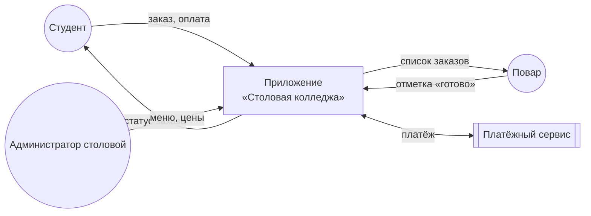
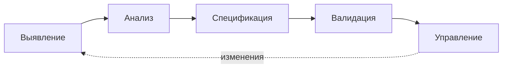
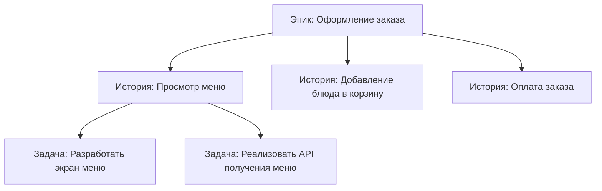
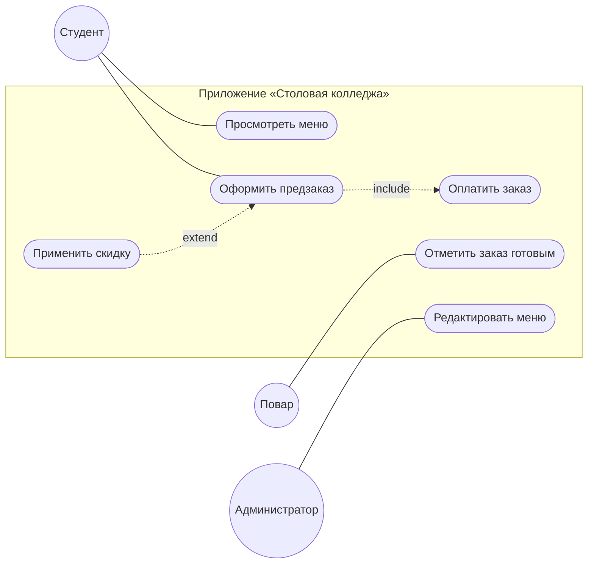
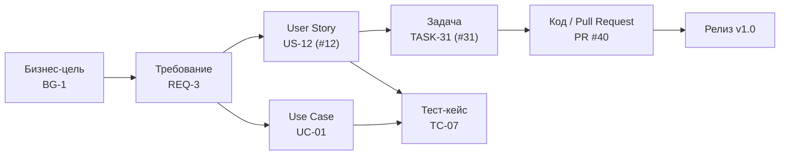
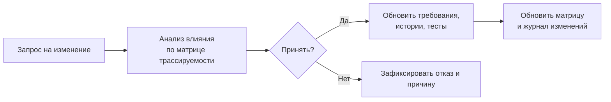

# Лекция. Инженерия требований и системный анализ

**Дисциплина:** Технологии разработки программного обеспечения
**Тема:** Инженерия требований и системный анализ. Сбор требований, User Stories, Use Cases. Критерии INVEST. Трассируемость требований
**Объём:** 4 академических часа (2 пары по 90 минут)
**Форма:** лекция с элементами беседы и мини-упражнениями
**Преподаватель:** старший преподаватель кафедры разработки программного обеспечения

---

# Часть I. План лекции

## 1. Цели и результаты обучения

После лекции студент **знает**:

- что такое требование, инженерия требований и системный анализ;
- классификацию требований и источники их выявления;
- структуру user story и use case, отличия между ними;
- критерии INVEST и признаки их нарушения;
- виды трассируемости и её роль в управлении изменениями.

Студент **умеет**:

- определять границы системы и заинтересованные стороны;
- формулировать проверяемые функциональные и нефункциональные требования;
- записывать user stories с критериями приёмки и проверять их по INVEST;
- описывать use case с основным и альтернативными сценариями;
- строить матрицу трассируемости и оценивать влияние изменения.

## 2. Структура и тайминг

| № | Раздел | Время | Форма |
|---|---|---|---|
| 1 | Введение: почему проекты проваливаются из-за требований | 5 мин | Беседа |
| 2 | Основные понятия. Системный анализ | 20 мин | Лекция |
| 3 | Классификация требований | 15 мин | Лекция + мини-упражнение №1 |
| 4 | Процесс инженерии требований. Сбор требований | 20 мин | Лекция + разбор диалога |
| 5 | Качества хорошего требования | 10 мин | Мини-упражнение №2 |
| | *Перерыв* | *10 мин* | |
| 6 | User Stories | 25 мин | Лекция + мини-упражнение №3 |
| 7 | Критерии INVEST | 15 мин | Разбор примеров |
| 8 | Use Cases | 25 мин | Лекция + мини-упражнение №4 |
| 9 | Сравнение User Stories и Use Cases. Документирование и валидация | 5 мин | Лекция |
| 10 | Трассируемость требований | 20 мин | Лекция + пример матрицы |
| 11 | Итоги, самоконтроль, задание на практику | 10 мин | Опрос |
| | **Итого** | **180 мин** | |

> Если время ограничено, разделы 9 и 10.9 можно дать в обзорном режиме, а мини-упражнения №3 и №4 перенести на практическое занятие.

## 3. Сквозной пример лекции

**Мобильное приложение «Столовая колледжа»** — студенты заранее заказывают обеды и получают их без очереди в назначенное время. На этом примере рассматриваются все понятия лекции.

## 4. Материалы для преподавателя

- проектор, доска или маркерная доска;
- раздаточные карточки для упражнений (бланк user story, бланк use case);
- презентация с диаграммами из раздела «Содержание».

---

# Часть II. Подробное содержание лекции

## 1. Введение: почему проекты проваливаются из-за требований

**Тезисы для изложения**

- Значительная доля дефектов и переделок возникает не на этапе кодирования, а из-за неверно понятых или изменённых требований.
- Стоимость исправления ошибки растёт по мере продвижения по жизненному циклу: ошибка в требованиях, найденная в эксплуатации, обходится на порядок дороже, чем найденная при анализе.
- Типичные причины провалов: заказчик «сам не знает, что хочет»; аналитик не задал вопросов; требования записаны расплывчато; изменения не отслеживаются; команда и заказчик понимают слова по-разному.

**Классический пример (для обсуждения в аудитории)**
Заказчик просит: «Сделайте, чтобы приложение работало быстро». Разработчик понимает: «страница открывается за 3 секунды». Заказчик имел в виду: «студент оформляет заказ за перемену в 15 минут, а в час пик в столовой 300 человек». Без уточнения нагрузки и времени требование невозможно ни реализовать, ни проверить.

**Вопрос аудитории:** «Где в жизненном цикле вы бы искали причины, если готовый продукт не нужен заказчику?»

---

## 2. Основные понятия. Системный анализ

### 2.1. Что такое требование

**Требование** — утверждение, описывающее необходимое свойство, возможность или ограничение системы, которое нужно для решения задачи заинтересованной стороны (определение по духу стандарта ISO/IEC/IEEE 29148).

Три взгляда на требование:

1. Потребность, условие или возможность, необходимая пользователю для решения проблемы или достижения цели.
2. Условие или возможность, которой должна обладать система, чтобы удовлетворить контракт, стандарт, спецификацию.
3. Документированное представление первых двух пунктов.

### 2.2. Инженерия требований

**Инженерия требований (Requirements Engineering, RE)** — систематический процесс выявления, анализа, документирования, проверки и управления требованиями на протяжении всего жизненного цикла продукта.

Ключевые роли:

| Роль | Задача |
|---|---|
| Заказчик / спонсор | Финансирует проект, определяет бизнес-цели |
| Пользователь | Работает с системой, знает реальные процессы |
| Бизнес-аналитик / системный аналитик | Выявляет, анализирует и документирует требования |
| Владелец продукта (Product Owner) | Отвечает за приоритеты и содержание бэклога |
| Разработчик, тестировщик | Реализуют и проверяют требования |

### 2.3. Системный анализ

**Системный анализ** — методология исследования сложных объектов через их представление как систем: определение целей, границ, элементов, связей и окружения.

**Основные понятия**

- **Система** — совокупность взаимосвязанных элементов, образующая целое и предназначенная для достижения цели.
- **Границы системы** — что входит в разработку, а что остаётся внешним миром.
- **Окружение** — внешние системы, пользователи и условия, взаимодействующие с системой.
- **Заинтересованная сторона (стейкхолдер)** — лицо или организация, на которых влияет система или которые влияют на неё.
- **Декомпозиция** — разбиение целого на части для понимания и разработки.

**Шаги системного анализа**

1. Определить проблему и цель («зачем нужна система»).
2. Описать текущий процесс («как есть»).
3. Определить границы и окружение.
4. Выявить заинтересованные стороны и их интересы.
5. Провести декомпозицию целей и функций.
6. Описать целевой процесс («как будет»).

**Пример для «Столовой колледжа»**

- *Проблема:* очереди в столовой, студенты не успевают пообедать за перемену.
- *Цель:* сократить время получения обеда до 3 минут для 90 % студентов к концу семестра.
- *Граница системы:* приложение и серверная часть; кассовая система столовой и учебная система колледжа — внешние.
- *Окружение:* платёжный сервис, система студенческих карт.

### 2.4. Заинтересованные стороны и их анализ

Матрица «влияние — интерес»:

| Влияние / интерес | Низкий интерес | Высокий интерес |
|---|---|---|
| **Высокое влияние** | Держать в курсе (администрация колледжа) | Работать плотно (директор столовой, владелец продукта) |
| **Низкое влияние** | Минимум внимания (сторонние поставщики) | Информировать (студенты, повара) |

**Вывод:** пропущенный стейкхолдер — источник «внезапных» требований на поздних этапах.

### 2.5. Диаграмма контекста (пример)



---

## 3. Классификация требований

### 3.1. Уровни требований (по К. Вигерсу)

| Уровень | Что описывает | Пример |
|---|---|---|
| **Бизнес-требования** | Зачем создаётся продукт, какую выгоду получит организация | Сократить время обслуживания до 3 минут |
| **Пользовательские требования** | Что пользователь сможет делать с системой | Студент может заказать обед заранее |
| **Функциональные (системные) требования** | Какое поведение должна реализовать система | Система должна формировать номер заказа после оплаты |

### 3.2. Функциональные и нефункциональные

- **Функциональные требования** — что система *делает* (функции, реакции на действия, расчёты, работа с данными).
- **Нефункциональные требования (НФТ)** — как система это делает, с какими *качествами*.

Группы НФТ по модели качества ISO/IEC 25010:

| Характеристика | Пример требования |
|---|---|
| Производительность | Страница меню открывается не дольше 2 с при 300 одновременных пользователях |
| Надёжность | Доступность сервиса не ниже 99 % в учебное время |
| Удобство использования | Заказ оформляется не более чем за 4 касания |
| Безопасность | Пароли хранятся только в виде хэша; сеанс завершается через 30 мин бездействия |
| Совместимость | Работа на Android 10 и новее |
| Сопровождаемость | Покрытие модульными тестами не менее 70 % |
| Переносимость | Возможность развернуть сервер в Docker |

### 3.3. Другие виды

- **Ограничения** — сроки, бюджет, технологический стек, законы (например, о персональных данных).
- **Требования к данным** — какие данные хранятся, сроки хранения, форматы.
- **Требования к интерфейсам** — с чем и как система взаимодействует (API, файлы, устройства).
- **Бизнес-правила** — политика организации (заказ можно отменить не позднее чем за 15 минут до выдачи).

### 3.4. Приоритизация: метод MoSCoW

| Категория | Смысл |
|---|---|
| **M**ust have | Без этого продукт не имеет смысла |
| **S**hould have | Важно, но можно временно обойтись |
| **C**ould have | Желательно, если хватит ресурсов |
| **W**on't have (this time) | Сознательно откладывается |

### 3.5. Модель Кано (кратко)

- **Обязательные** свойства (basic): их отсутствие вызывает недовольство, наличие не радует.
- **Линейные** (performance): чем лучше, тем выше удовлетворённость.
- **Восхищающие** (delighters): неожиданные приятные возможности.

**Мини-упражнение №1 (5 мин).** Классифицируйте: а) «Приложение должно оформлять заказ»; б) «Приложение не должно падать при 500 пользователях»; в) «Заказ нельзя оформить менее чем за 20 минут до выдачи»; г) «Разработка должна завершиться к 1 декабря». *(Ответ: функциональное; НФТ — надёжность/производительность; бизнес-правило; ограничение.)*

---

## 4. Процесс инженерии требований. Сбор требований

### 4.1. Этапы процесса



| Этап | Результат |
|---|---|
| Выявление (elicitation) | Сырые требования, протоколы встреч |
| Анализ | Согласованные, приоритизированные, непротиворечивые требования |
| Спецификация | Документ или бэклог (SRS, user stories, use cases) |
| Валидация | Подтверждение заказчиком, что это именно то, что нужно |
| Управление | Контроль изменений, версий и трассируемости |

Процесс **итеративный**: в гибких методологиях цикл повторяется в каждом спринте.

### 4.2. Техники выявления требований

| Техника | Когда применять | Плюсы | Минусы |
|---|---|---|---|
| **Интервью** | Начало проекта, выявление целей | Глубина, можно уточнять | Время, субъективность |
| **Анкетирование** | Много пользователей | Охват, дешевизна | Поверхностность |
| **Наблюдение** | Сложные производственные процессы | Видно реальную работу | Трудоёмко, эффект наблюдателя |
| **Анализ документов** | Есть регламенты, отчёты, старая система | Точные данные | Документы устаревают |
| **Воркшоп / мозговой штурм** | Нужен консенсус между сторонами | Быстро, согласованно | Доминирование громких участников |
| **Прототипирование** | Требования неясны, важен UI | Быстрая обратная связь | Иллюзия «почти готового» продукта |
| **Анализ конкурентов** | Выход на рынок | Идеи, типовые функции | Копирование чужих ошибок |
| **Сценарии использования** | Описание взаимодействия | Понятны всем | Не охватывают НФТ |

### 4.3. Как задавать вопросы

**Правила**

1. Начинайте с **открытых** вопросов («Расскажите, как сейчас проходит обед?»), затем уточняйте **закрытыми** («Сколько человек в час пик?»).
2. Используйте **«5 почему»** для выхода на корень проблемы.
3. Просите **примеры и цифры**, а не оценки («часто» → «сколько раз в неделю?»).
4. Перефразируйте услышанное («Правильно ли я понял, что…»).
5. Фиксируйте не только *решения*, но и *потребности* («нужна кнопка» → «нужно быстро повторить вчерашний заказ»).
6. Задавайте вопросы про исключения («А если блюдо закончилось?»).

**Пример диалога**

> **Аналитик:** Расскажите, как студент сейчас получает обед?
> **Директор столовой:** Стоит в очереди, выбирает, платит на кассе.
> **Аналитик:** Что в этом процессе вас беспокоит больше всего?
> **Директор:** Очередь в 12:00. Люди уходят голодными.
> **Аналитик:** Сколько человек приходит в этот час?
> **Директор:** Около 300 за 20 минут.
> **Аналитик:** Если студент заказывает заранее, что должно случиться с заказом, если он не пришёл?
> **Директор:** Ну… через 15 минут блюдо отдаём другим.

**Что выявлено:** цель (сократить очередь), нагрузка (300 человек за 20 минут), бизнес-правило (заказ действует 15 минут), пропущенный сценарий (неявка). Всё это — будущие требования.

### 4.4. Типичные ошибки при сборе

- Общение только с заказчиком и игнорирование конечных пользователей.
- Принятие первого озвученного решения как требования.
- Отсутствие протоколов, «запомнили в голове».
- Смешение «что делать» и «как реализовать» (требование «использовать PostgreSQL» — это ограничение, а не потребность).
- Отсутствие подтверждения понятого заказчиком.

---

## 5. Качества хорошего требования

### 5.1. Критерии (по ISO/IEC/IEEE 29148)

| Критерий | Вопрос для проверки |
|---|---|
| Необходимое | Что произойдёт, если мы его уберём? |
| Однозначное | Можно ли понять его по-разному? |
| Полное | Хватает ли информации, чтобы реализовать? |
| Непротиворечивое | Не конфликтует ли с другими требованиями? |
| Выполнимое | Реально ли реализовать в рамках ограничений? |
| Проверяемое | Есть ли способ доказать, что оно выполнено? |
| Прослеживаемое | Есть ли у него уникальный ID и источник? |

### 5.2. Слова-ловушки

«быстро», «удобно», «современный», «интуитивно», «и т. д.», «по возможности», «надёжно», «как правило», «максимально».

### 5.3. Переписывание плохих требований

| Плохо | Проблема | Хорошо |
|---|---|---|
| Приложение должно работать быстро | Не измеримо | Открытие меню — не более 2 с при 300 одновременных пользователях |
| Интерфейс должен быть удобным | Субъективно | Новый пользователь оформляет первый заказ без подсказок за ≤ 2 мин (проверяется тестированием на 5 пользователях) |
| Система должна поддерживать разные платежи | Неполно | Система принимает оплату банковской картой и через СБП |
| Использовать базу данных | Это решение, а не потребность | Данные заказов хранятся не менее 1 года |

**Мини-упражнение №2 (5 мин).** Перепишите: «Приложение должно быть безопасным и надёжным».
*(Возможный ответ: «Пароль хранится в виде хэша с солью»; «Доступность сервиса ≥ 99 % с 8:00 до 17:00 по будням».)*

---

## 6. User Stories

### 6.1. Идея

**User Story (пользовательская история)** — короткое описание функциональности с точки зрения пользователя, которое служит поводом для обсуждения.

**Шаблон**

```text
Как <роль>,
я хочу <действие / возможность>,
чтобы <ценность / цель>.
```

**Пример**

```text
Как студент,
я хочу повторить вчерашний заказ одним нажатием,
чтобы не тратить время перемены на выбор блюд.
```

### 6.2. Модель 3C (Рон Джеффрис)

| C | Смысл |
|---|---|
| **Card** (карточка) | Краткая запись истории, напоминание |
| **Conversation** (обсуждение) | Детали выясняются в беседе команды и заказчика |
| **Confirmation** (подтверждение) | Критерии приёмки, по которым проверяется результат |

### 6.3. Критерии приёмки

**Формат Given–When–Then (Gherkin)**

```gherkin
Сценарий: Повтор вчерашнего заказа
  Дано: студент авторизован и у него есть заказ за предыдущий день
  Когда: он нажимает «Повторить заказ»
  Тогда: блюда из вчерашнего заказа добавляются в корзину
  И: недоступные блюда помечаются и не добавляются
```

**Альтернатива:** маркированный список условий («корзина содержит те же блюда», «цены актуальные»).

### 6.4. Иерархия: эпики, истории, задачи



- **Эпик** — крупная функциональность, не помещающаяся в одну итерацию.
- **История** — законченная ценность для пользователя, помещается в итерацию.
- **Задача** — техническая работа разработчика (не имеет самостоятельной ценности для пользователя).

### 6.5. Как разделять большие истории

| Приём | Пример |
|---|---|
| По шагам сценария | «Оформить заказ» → «Выбрать блюда» → «Оплатить» → «Получить уведомление» |
| По правилам | «Оплата» → карта; СБП |
| По ролям | «Просмотр заказов» → студент; повар |
| По данным | «Поиск блюд» → по названию; по категории |
| По операциям CRUD | «Управление меню» → создание; изменение; удаление |
| Простой вариант → усложнения | Заказ без оплаты онлайн → добавить оплату |

**Правило:** делить *вертикально* (сквозной срез от интерфейса до данных), а не по слоям («сделать базу», «сделать интерфейс»).

### 6.6. Готовность и завершённость

- **Definition of Ready (DoR)** — история готова к взятию в работу: понятна, оценена, есть критерии приёмки, соответствует INVEST.
- **Definition of Done (DoD)** — история завершена: код в основной ветке, тесты пройдены, критерии приёмки выполнены, код проверен.

### 6.7. Примеры плохих и хороших историй

| Плохо | Почему | Лучше |
|---|---|---|
| Как разработчик, я хочу базу данных | Нет ценности для пользователя | Как студент, я хочу видеть историю заказов, чтобы повторять любимые обеды |
| Как пользователь, я хочу всё, что есть у конкурентов | Слишком абстрактно | Конкретные истории по каждой функции |
| Как студент, я хочу оформить заказ, оплатить, получить чек и отменить его | Несколько историй в одной | Разделить на 4 истории |

**Мини-упражнение №3 (10 мин).** Запишите две user stories для роли «Повар» в приложении «Столовая» с критериями приёмки.

---

## 7. Критерии INVEST

**INVEST** (Билл Уэйк) — чек-лист качества пользовательской истории.

| Буква | Критерий | Смысл | Нарушение | Как исправить |
|---|---|---|---|---|
| **I** | **Independent** (независимая) | Можно реализовывать в любом порядке | «Оплата» невозможна без «Корзины», «Корзина» — без «Меню», цепочка неразрывна | Пересобрать границы историй, объединить сильно связанные, ввести допущения |
| **N** | **Negotiable** (обсуждаемая) | Детали обсуждаются, история не является контрактом | В истории прописан способ реализации: «использовать PostgreSQL и кнопку в левом углу» | Убрать реализацию, оставить потребность |
| **V** | **Valuable** (ценная) | Даёт ценность пользователю или бизнесу | «Как разработчик, я хочу настроить Docker» | Связать с ценностью или оформить как техническую задачу/enabler |
| **E** | **Estimable** (оцениваемая) | Команда может оценить трудозатраты | Слишком расплывчато или неизвестна технология | Провести исследование (spike), уточнить требования |
| **S** | **Small** (небольшая) | Помещается в итерацию (обычно 1–3 дня работы) | «Реализовать всю систему оплаты» | Разделить вертикально |
| **T** | **Testable** (проверяемая) | Есть критерии приёмки | «Интерфейс должен быть удобным» | Добавить измеримые критерии Given-When-Then |

### 7.1. Пример проверки истории по INVEST

**История:** «Как студент, я хочу оплатить заказ картой, чтобы не стоять на кассе.»

| Критерий | Оценка | Комментарий |
|---|---|---|
| Independent | Частично | Требует наличия корзины; допустимо, порядок работ очевиден |
| Negotiable | Да | Способ оплаты и провайдер не зафиксированы |
| Valuable | Да | Экономит время студента |
| Estimable | Да | Оплата картой хорошо изучена |
| Small | Нет | Включает интеграцию с банком, обработку ошибок, чек |
| Testable | Да, после добавления критериев | Нужны сценарии успешной и неуспешной оплаты |

**Решение:** разделить на «Оплата картой (успешный сценарий)», «Обработка отказа платежа», «Получение чека».

### 7.2. Типичные ошибки

- Формальное соблюдение шаблона «Как… хочу… чтобы…» без реальной ценности.
- Истории-«технические задачи» под видом пользовательских.
- Отсутствие критериев приёмки.
- Слишком крупные истории («эпики» под видом историй).

---

## 8. Use Cases (варианты использования)

### 8.1. Идея

**Use Case** — описание последовательности взаимодействия **актора** с системой для достижения **измеримой цели** актора, включая основной и альтернативные сценарии.

**Актор** — роль (человек, внешняя система, время), которая взаимодействует с системой.

### 8.2. Уровни целей (по А. Коберну)

| Уровень | Описание | Пример |
|---|---|---|
| Резюмирующий (summary) | Бизнес-цель, множество сессий | «Организовать питание студентов» |
| **Пользовательский** (user goal) | Одна сессия, одна цель актора | «Оформить предзаказ обеда» |
| Подфункция (subfunction) | Шаг внутри сценария | «Проверить наличие блюда» |

Основной уровень для аналитика — **пользовательский**.

### 8.3. Структура use case

| Раздел | Содержание |
|---|---|
| ID и название | UC-01. Оформить предзаказ обеда |
| Актор (основной) | Студент |
| Второстепенные акторы | Платёжный сервис |
| Цель | Заказать обед на определённое время |
| Предусловия | Студент авторизован; столовая работает |
| Триггер | Студент нажимает «Новый заказ» |
| Основной сценарий | Пошаговое описание успешного пути |
| Альтернативные сценарии | Варианты развития событий |
| Исключения | Ошибки, сбои |
| Постусловия | Состояние системы после успешного выполнения |
| Бизнес-правила | Ограничения, влияющие на сценарий |

### 8.4. Пример use case

**UC-01. Оформить предзаказ обеда**

| Поле | Значение |
|---|---|
| Основной актор | Студент |
| Второстепенный актор | Платёжный сервис |
| Предусловия | Студент авторизован в приложении |
| Постусловие | Заказ сохранён со статусом «Оплачен», студенту выдан номер |

**Основной сценарий**

1. Студент выбирает пункт «Новый заказ».
2. Система показывает меню на сегодня.
3. Студент добавляет блюда в корзину.
4. Студент выбирает время получения.
5. Система проверяет наличие блюд и доступность времени.
6. Студент подтверждает заказ и выбирает способ оплаты.
7. Система передаёт платёж платёжному сервису.
8. Платёжный сервис подтверждает оплату.
9. Система сохраняет заказ, присваивает номер и показывает его студенту.

**Альтернативные сценарии**

- **3а.** Блюдо закончилось. Система сообщает об этом и предлагает замену; возврат на шаг 3.
- **4а.** Выбранное время занято. Система предлагает ближайшее свободное время; возврат на шаг 4.

**Исключения**

- **8а.** Платёж отклонён. Система сообщает причину, заказ остаётся в корзине; студент может выбрать другой способ оплаты (возврат на шаг 6).
- **8б.** Платёжный сервис недоступен. Система сохраняет заказ как «Ожидает оплаты» и уведомляет студента.

**Бизнес-правило:** заказ действует 15 минут после выбранного времени, затем отменяется.

### 8.5. Диаграмма вариантов использования

В UML: актор (человечек), овал (вариант использования), прямоугольник (граница системы), связи `include` и `extend`.

- **include** — обязательное включение подсценария (Оформить заказ → Оплатить заказ).
- **extend** — необязательное расширение (Оформить заказ → Применить скидку).

Схематичное представление:



### 8.6. Правила написания

1. Название — **глагол + объект** («Оформить заказ», а не «Заказ»).
2. Шаги — простые предложения в настоящем времени: «Студент выбирает…», «Система показывает…».
3. Один use case — одна цель актора.
4. Не описывать интерфейс детально (кнопки, цвета).
5. Основной сценарий — 5–9 шагов.
6. Исключения описывать не менее важно, чем успешный путь.

**Мини-упражнение №4 (10 мин).** Опишите use case «Отметить заказ готовым» для актора «Повар»: основной сценарий и одно исключение.

---

## 9. Сравнение User Stories и Use Cases. Документирование и валидация

### 9.1. Сравнение

| Признак | User Story | Use Case |
|---|---|---|
| Объём | Одна-две строки + критерии | Страница структурированного текста |
| Детализация | Низкая, уточняется в беседе | Высокая, полный сценарий |
| Фокус | Ценность для пользователя | Взаимодействие актора и системы |
| Исключения | В критериях приёмки | Явный раздел |
| Методология | Scrum, Kanban, XP | RUP, водопадные и смешанные подходы |
| Тестирование | Критерии приёмки → тесты | Сценарии → тест-кейсы |
| Когда применять | Быстрые итерации, меняющиеся требования | Сложная логика, много исключений, регуляторные требования |

**Практика:** их **комбинируют**. Эпик и истории задают ценность и приоритеты, а use case детализирует сложные сценарии (оплата, возврат, интеграции).

### 9.2. Формы документирования

- **Бэклог продукта** (список историй с приоритетами).
- **SRS** (Software Requirements Specification, ISO/IEC/IEEE 29148): введение, общее описание, функциональные требования, НФТ, интерфейсы, приложения.
- **Прототипы и макеты** (Figma, наброски на бумаге).
- **Глоссарий** — единые определения терминов.

### 9.3. Валидация требований

| Метод | Суть |
|---|---|
| Просмотр (review) | Совместное чтение документа |
| Инспекция | Формальная проверка по чек-листу |
| Прототипирование | Демонстрация заказчику |
| Разработка тестов по требованиям | Если тест написать нельзя, требование нужно переписать |
| Демонстрация инкремента (sprint review) | Обратная связь на работающем продукте |

**Верификация** отвечает на вопрос «Правильно ли мы делаем продукт?» (соответствие спецификации). **Валидация** — «Тот ли продукт мы делаем?» (соответствие потребности).

---

## 10. Трассируемость требований

### 10.1. Определение

**Трассируемость (traceability)** — возможность проследить связь требования с его источником, а также с последующими артефактами: проектом, кодом, тестами, документацией — в прямом и обратном направлении.

### 10.2. Виды

| Вид | Направление | Вопрос |
|---|---|---|
| **Прямая** (forward) | Требование → проект → код → тест | «Где реализовано и проверено это требование?» |
| **Обратная** (backward) | Код / тест → требование → источник | «Зачем существует этот код и кто его заказал?» |
| **Вертикальная** | Между уровнями (цель → требование → задача) | «Как цель разложена на работу?» |
| **Горизонтальная** | Между артефактами одного уровня (история ↔ use case ↔ макет) | «Какие артефакты описывают одно и то же?» |

### 10.3. Цепочка трассируемости



### 10.4. Зачем нужна трассируемость

1. **Анализ влияния изменений:** видно, какие истории, код и тесты затронет изменение требования.
2. **Контроль полноты:** нет требований без реализации и без тестов.
3. **Отсутствие «золочения»:** нет кода, не связанного ни с одним требованием.
4. **Приёмка и аудит:** можно доказать заказчику, что всё выполнено.
5. **Планирование тестирования:** тесты покрывают все требования.
6. **Управление проектом:** прозрачный прогресс по требованиям.

### 10.5. Атрибуты требования

| Атрибут | Пример |
|---|---|
| Идентификатор | REQ-003 |
| Название / описание | Система должна формировать номер заказа |
| Тип | Функциональное / НФТ |
| Источник | Интервью с директором столовой, 12.09 |
| Приоритет | Must |
| Статус | Предложено / Утверждено / Реализовано / Проверено / Отклонено |
| Версия | 1.2 |
| Ответственный | Иванов И. |
| Связи | US-12, UC-01, TC-07 |

### 10.6. Матрица трассируемости (RTM)

| Цель | Требование | User Story | Use Case | Задача (Issue) | Pull Request | Тест-кейс | Статус |
|---|---|---|---|---|---|---|---|
| BG-1 | REQ-001 Просмотр меню | US-01 (#5) | UC-01 | #21, #22 | PR #40 | TC-01 | Проверено |
| BG-1 | REQ-002 Предзаказ | US-02 (#6) | UC-01 | #23 | PR #44 | TC-02, TC-03 | Реализовано |
| BG-1 | REQ-005 Отмена заказа | US-05 (#9) | UC-02 | — | — | — | **Не реализовано** |

**Как читать:** пустая ячейка «Тест-кейс» означает риск, пустая «Pull Request» у статуса «Реализовано» означает ошибку учёта.

### 10.7. Трассируемость в Git и GitHub

| Приём | Пример |
|---|---|
| Единая нумерация | Каждая история — Issue с номером, номер попадает в ID (US-12 = #12) |
| Имя ветки | `feature/12-repeat-order` |
| Сообщение коммита | `feat: повтор заказа (refs #12)` |
| Ссылка в Pull Request | В описании: `Closes #12` (Issue закроется при слиянии PR) |
| Связь «эпик — история» | Подзадачи (sub-issues) или список задач `- [ ] #12` |
| Тест-кейсы | Файл `docs/test-cases.md` с ссылками на Issue или автотесты с именем `US12_RepeatOrder_...` |
| Матрица | `docs/traceability-matrix.md`, обновляется при каждом изменении |
| Доска проекта (GitHub Projects) | Пользовательские поля: тип, приоритет, ID требования |

### 10.8. Управление изменениями



**Пример.** Заказчик просит изменить срок действия заказа с 15 до 10 минут. По матрице находим: REQ-006 → US-08 → UC-01 (альт. сценарий) → TC-05 → задача #27. Оцениваем: затрагивает 1 историю, 1 use case, 1 тест и 1 задачу. Решение принимает владелец продукта, изменения вносятся в связанные артефакты, запись — в журнал изменений.

### 10.9. Типичные проблемы

- Матрица создаётся один раз и не обновляется.
- Слишком подробная трассировка (тратится больше времени, чем приносит пользы).
- Нет уникальных идентификаторов.
- Связи хранятся «в голове» аналитика.
- Требование в одном месте, а тест — в другом без ссылки.

**Правило меры:** трассировать столько связей, сколько нужно для анализа изменений и контроля покрытия.

---

## 11. Итоги лекции

1. Требования — основа проекта; ошибки в них дороже всего.
2. Системный анализ определяет границы, цели и заинтересованные стороны.
3. Требования делятся на бизнес-, пользовательские и функциональные, а также функциональные и нефункциональные; их приоритизируют (MoSCoW).
4. Сбор требований — интервью, наблюдение, анализ документов, воркшопы, прототипы. Главное — задавать вопросы и подтверждать понимание.
5. User story фиксирует ценность («Как… хочу… чтобы…») и критерии приёмки; качество проверяется по INVEST.
6. Use case описывает взаимодействие актора и системы, включая альтернативы и исключения.
7. Трассируемость связывает цель, требование, историю, задачу, код, тест и позволяет управлять изменениями.

### Вопросы для самоконтроля

1. Чем требование отличается от решения? Приведите пример.
2. Что входит в границы системы и почему их важно определять?
3. Назовите уровни требований и приведите по примеру.
4. Приведите три примера нефункциональных требований и способы их проверки.
5. Какие техники выявления требований вы выберете для проекта с 500 будущими пользователями и почему?
6. Из каких частей состоит user story и что такое 3C?
7. Расшифруйте INVEST. Какой критерий чаще всего нарушают и как это исправить?
8. Чем use case отличается от user story? Когда лучше использовать каждый подход?
9. Что такое прямая и обратная трассируемость?
10. Как матрица трассируемости помогает при изменении требования?

### Тестовые задания (для проверки на занятии)

1. Какое из утверждений является **проверяемым** требованием?
   а) «Система должна быть быстрой»; б) «Поиск блюда выполняется не дольше 1 с при 1000 записей»; в) «Интерфейс должен быть красивым».
   *(Ответ: б.)*
2. Какая история нарушает критерий **V** из INVEST?
   а) «Как студент, я хочу видеть меню»; б) «Как разработчик, я хочу переписать сервис на другой язык»; в) «Как повар, я хочу видеть список заказов».
   *(Ответ: б.)*
3. Как называется связь от кода к требованию?
   *(Ответ: обратная трассируемость.)*
4. В use case «Оплатить заказ» платёж отклонён. Куда относится этот сценарий?
   *(Ответ: раздел «Исключения» / альтернативные сценарии.)*
5. Какой ключевой признак хорошо разделённой истории?
   *(Ответ: вертикальный срез, приносящий ценность пользователю.)*

### Задание на практическое занятие

Практическая работа: **«Управление требованиями в GitHub Projects»** (см. файл `Prakticheskaya_rabota_GitHub_Projects.md`). Студентам предстоит провести системный анализ выбранной предметной области, оформить требования как user stories и use cases, проверить их по INVEST и построить матрицу трассируемости в GitHub.

---

## Рекомендуемая литература

1. Вигерс К., Битти Дж. Разработка требований к программному обеспечению. — СПб.: БХВ-Петербург (актуальное издание).
2. Коберн А. Современные методы описания функциональных требований к системам. — М.: Лори.
3. Кон М. Пользовательские истории: гибкая разработка программного обеспечения. — М.: Вильямс.
4. Соммервилл И. Инженерия программного обеспечения. — М.: Вильямс.
5. ISO/IEC/IEEE 29148:2018. Systems and software engineering — Life cycle processes — Requirements engineering.
6. ISO/IEC 25010:2011. Systems and software engineering — Systems and software Quality Requirements and Evaluation (SQuaRE) — System and software quality models.
7. Документация GitHub Projects: <https://docs.github.com/issues/planning-and-tracking-with-projects>
8. Guide to the Business Analysis Body of Knowledge (BABOK Guide), IIBA.
