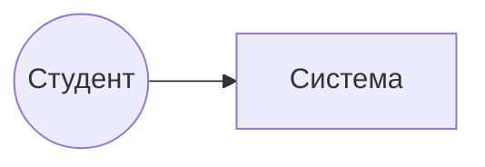

# Практическая работа. Управление требованиями в GitHub Projects

|                               |                                                                                         |
| ----------------------------- | --------------------------------------------------------------------------------------- |
| **Дисциплина**                | Технологии разработки программного обеспечения                                          |
| **Тема**                      | Инженерия требований: системный анализ, User Stories, Use Cases, INVEST, трассируемость |
| **Среда управления проектом** | GitHub (Issues, Projects, Pull Requests)                                                |
| **Форма работы**              | Индивидуально или в парах (аналитик — заказчик)                                         |
| **Время выполнения**          | 4 академических часов (2 занятия по 2 часа)                                             |
| **Основа**                    | Лекция «Инженерия требований и системный анализ»                                        |

---

## 1. Цель работы

Научиться проводить системный анализ предметной области, формулировать требования в виде user stories и use cases, проверять их по критериям INVEST и обеспечивать трассируемость требований с помощью GitHub Projects.

## 2. Результаты обучения

По итогам работы студент:

- определяет границы системы и заинтересованные стороны;
- проводит интервью и оформляет протокол;
- записывает функциональные и нефункциональные требования, приоритизирует по MoSCoW;
- оформляет user stories с критериями приёмки и проверяет их по INVEST;
- описывает use cases с основным, альтернативным и исключительным сценариями;
- настраивает GitHub Project (поля, представления, автоматизацию);
- строит матрицу трассируемости и выполняет анализ влияния изменения.

## 3. Необходимые условия

- Аккаунт на GitHub (<https://github.com>).
- Браузер, установленный Git (по желанию: Rider или другая IDE).

## 4. Варианты предметных областей

Выберите вариант по номеру в журнале (номер % 10; 0 → вариант 10) либо используйте свой проект утвержденный на предыдущем занятии.

| № | Система | Основные акторы |
|---|---|---|
| 1 | Электронный журнал успеваемости колледжа | Студент, преподаватель, куратор |
| 2 | Приложение «Столовая колледжа» (предзаказ обедов) | Студент, повар, администратор |
| 3 | Система бронирования аудиторий и оборудования | Преподаватель, сотрудник хозчасти |
| 4 | Библиотека колледжа (каталог и выдача книг) | Читатель, библиотекарь |
| 5 | Система заявок на ремонт оборудования | Сотрудник, техник, руководитель |
| 6 | Расписание занятий и уведомления об изменениях | Студент, диспетчер, преподаватель |
| 7 | Система записи в спортивные секции | Студент, тренер |
| 8 | Портал практики и стажировок | Студент, работодатель, руководитель практики |
| 9 | Мобильное приложение для записи к врачу в медпункте колледжа | Студент, медработник |
| 10 | Система учёта студенческих проектов и защит | Студент, руководитель, комиссия |

> Пример в этой работе построен на варианте «Столовая колледжа». Свой вариант оформляйте по тем же шаблонам.

## 5. Распределение по занятиям

| Занятие | Этапы                                                                  | Ориентировочное время                                             |
| ------- | ---------------------------------------------------------------------- | ----------------------------------------------------------------- |
| 1       | 0–3: репозиторий, системный анализ, сбор требований, настройка Project | ≈ 40 мин                                                          |
| 2       | 4–6: шаблоны Issue, эпики и истории, INVEST-ревью                      | ≈ 40 мин                                                          |
| 3       | 7–10: use cases, трассируемость, изменение требований, сдача           | ≈ 100 мин (часть оформления допускается выполнить самостоятельно) |

## 6. Итоговые результаты (что нужно сдать)

1. Репозиторий на GitHub с папкой `docs`:
   - `01-system-analysis.md`
   - `02-interview.md`
   - `03-use-cases.md`
   - `04-traceability-matrix.md`
   - `05-test-cases.md`
   - `06-change-log.md`
2. Настроенный GitHub Project с тремя представлениями: **Backlog (Table)**, **Board**, **Roadmap**.
3. Не менее **2 эпиков**, **10 user stories** (в том числе **2 нефункциональных требования**), **3 use cases**.
4. Один Pull Request, автоматически закрывающий историю.
5. Заполненный отчёт в `README.md` со ссылками и скриншотами.

---

## 7. Ход работы

### Этап 0. Подготовка репозитория (10 мин)

1. Войдите на GitHub. В правом верхнем углу нажмите **+ → New repository**.
2. Заполните поля:
   - **Repository name:** `req-<фамилия>-<вариант>` (например, `req-ivanov-02`);
   - **Description:** краткое название системы;
   - **Visibility:** Private;
   - отметьте **Add a README file**.
3. Нажмите **Create repository**.
4. Откройте **Settings → Collaborators → Add people** и добавьте преподавателя.
5. Создайте структуру папок: в репозитории нажмите **Add file → Create new file**, в поле имени введите `docs/01-system-analysis.md` (слэш создаёт папку), позже наполните файл (этап 1).

**Контроль:** репозиторий создан, преподаватель добавлен.

---

### Этап 1. Системный анализ (20 мин)

Создайте файл `docs/01-system-analysis.md` и заполните по шаблону.
# Системный анализ: <название системы>

## 1. Проблема и цель
- **Проблема:** ...
- **Бизнес-цель (измеримая):** ...

## 2. Границы системы
- **Входит в систему:** ...
- **Не входит (внешние системы):** ...

## 3. Заинтересованные стороны
| Стейкхолдер | Роль | Интересы / ожидания | Влияние | Интерес |
|---|---|---|---|---|
| Студент | Пользователь | Быстро сделать заказ | Среднее | Высокий |
| Директор столовой | Заказчик | Сократить очереди | Высокое | Высокий |

## 4. Ограничения
- Сроки, бюджет, технологии, законодательство (например, о персональных данных)

## 5. Диаграмма контекста


## 6. Глоссарий
| Термин    | Определение                           |
| --------- | ------------------------------------- |
| Предзаказ | Заказ блюд заранее на выбранное время |

**Что нужно сделать**

1. Сформулируйте проблему и **измеримую** цель.
2. Опишите границы системы.
3. Укажите **не менее 5** заинтересованных сторон.
4. Постройте диаграмму контекста в Mermaid (GitHub отображает её автоматически).
5. Составьте глоссарий (не менее 5 терминов).
6. Нажмите **Commit changes** с сообщением `docs: системный анализ`.

**Контроль:** файл открывается на GitHub, диаграмма отображается.

---

### Этап 2. Сбор требований (25 мин)

**Форма:** работа в паре. Один студент — аналитик, второй — «заказчик» (играет роль представителя предметной области). Затем поменяйтесь ролями.

1. Подготовьте **не менее 10 вопросов** (открытых и закрытых). Используйте технику «5 почему».
2. Проведите интервью (10 минут), ведите протокол.
3. Создайте файл `docs/02-interview.md`:

# Протокол интервью

- **Дата:** ...
- **Аналитик:** ...
- **Респондент (роль):** ...

## Вопросы и ответы
| № | Вопрос | Ответ |
|---|---|---|
| 1 | Расскажите, как сейчас проходит процесс? | ... |

## Выявленные требования (черновик)
| ID      | Формулировка                                      | Тип (F/NF/Огр./БП) | Приоритет (MoSCoW) | Источник           |
| ------- | ------------------------------------------------- | ------------------ | ------------------ | ------------------ |
| REQ-001 | Студент может просмотреть меню на сегодня         | F                  | Must               | Интервью, вопрос 2 |
| REQ-002 | Открытие меню не дольше 2 с при 300 пользователях | NF                 | Should             | Интервью, вопрос 5 |

4. Запишите не менее **12 требований**, из них минимум 3 нефункциональных и 1 бизнес-правило.
5. Проверьте формулировки по критериям (однозначность, проверяемость). Замените слова «быстро», «удобно», «надёжно» на измеримые значения.
6. Закоммитьте файл: `docs: протокол интервью и черновик требований`.

**Контроль:** есть протокол, не менее 12 требований с приоритетами и источниками.

---

### Этап 3. Создание и настройка GitHub Project (25 мин)

#### 3.1. Создание проекта

1. Откройте свой профиль GitHub → вкладка **Projects** → **New project**.
2. Выберите шаблон **Table** (или **Board**), нажмите **Create project**.
3. Назовите проект: `Требования — <название системы>`.
4. Свяжите проект с репозиторием: откройте репозиторий → вкладка **Projects** → **Link a project** → выберите созданный проект.
5. Добавьте преподавателя: в проекте нажмите **⋯ (меню) → Settings → Manage access** и добавьте пользователя с правом чтения. Если Project приватный, проверьте видимость (**Visibility**).

#### 3.2. Настройка поля Status

1. В проекте откройте **⋯ → Settings**, найдите поле **Status**.
2. Оставьте/задайте значения: `Backlog`, `Ready`, `In progress`, `In review`, `Done`.
3. Смысл значений:
   - `Backlog` — требование выявлено;
   - `Ready` — история соответствует INVEST и готова к работе (DoR);
   - `In progress` — идёт реализация;
   - `In review` — открыт Pull Request;
   - `Done` — выполнено (DoD).

#### 3.3. Пользовательские поля

В **Settings → New field** создайте поля:

| Название | Тип | Значения |
|---|---|---|
| `Type` | Single select | Epic, User Story, Use Case, NFR, Task |
| `Priority` | Single select | Must, Should, Could, Won't |
| `Req ID` | Text | — |
| `Story Points` | Number | — |
| `INVEST` | Single select | Not checked, Passed, Needs work |
| `Iteration` | Iteration | длительность 1 неделя |
| `Source` | Text | — |

#### 3.4. Представления (Views)

1. **Backlog (Table).** Первое представление переименуйте в `Backlog`. Отобразите столбцы: Title, Type, Priority, Req ID, Status, INVEST, Story Points. Отсортируйте по Priority.
2. **Board.** Нажмите **+ New view → Board**, назовите `Board`. Группировка по Status (Column field: Status).
3. **Roadmap.** **+ New view → Roadmap**, назовите `Roadmap`. Задайте поле дат Iteration или Target date (создайте поле **Target date** типа Date, если нужно).

#### 3.5. Автоматизация (Workflows)

1. Откройте **⋯ → Workflows**.
2. Включите **Item added to project** → *Set value* `Status: Backlog`.
3. Включите **Item closed** → *Set value* `Status: Done`.
4. Включите **Pull request merged** → *Set value* `Status: Done`.

#### 3.6. Метки (Labels)

В репозитории: **Issues → Labels → New label**. Создайте:

| Метка | Цвет (пример) | Назначение |
|---|---|---|
| `epic` | фиолетовый | Эпик |
| `user-story` | синий | Пользовательская история |
| `use-case` | голубой | Вариант использования |
| `nfr` | серый | Нефункциональное требование |
| `task` | зелёный | Техническая задача |
| `change-request` | оранжевый | Запрос на изменение |
| `must` / `should` / `could` | красный / жёлтый / зелёный | Приоритет |

**Контроль:** проект создан, связан с репозиторием, есть 3 представления, включена автоматизация.

---

### Этап 4. Шаблоны Issue (15 мин)

Шаблоны обеспечивают единый формат и ускоряют создание требований.

1. В репозитории нажмите **Add file → Create new file**.
2. Создайте файл `.github/ISSUE_TEMPLATE/user-story.yml`:

```yaml
name: Пользовательская история
description: Требование в формате User Story
title: "US: "
labels: ["user-story"]
body:
  - type: input
    id: req_id
    attributes:
      label: ID требования
      placeholder: REQ-001
    validations:
      required: true
  - type: textarea
    id: story
    attributes:
      label: История
      description: Формат «Как <роль>, я хочу <действие>, чтобы <ценность>»
      placeholder: Как студент, я хочу ..., чтобы ...
    validations:
      required: true
  - type: textarea
    id: criteria
    attributes:
      label: Критерии приёмки
      description: Формат Дано / Когда / Тогда
      placeholder: |
        - Дано ..., когда ..., тогда ...
    validations:
      required: true
  - type: dropdown
    id: priority
    attributes:
      label: Приоритет (MoSCoW)
      options:
        - Must
        - Should
        - Could
        - Won't
    validations:
      required: true
  - type: input
    id: source
    attributes:
      label: Источник требования
      placeholder: Интервью, вопрос 3
  - type: checkboxes
    id: invest
    attributes:
      label: Предварительная проверка INVEST
      options:
        - label: Independent — независима
        - label: Negotiable — обсуждаема
        - label: Valuable — ценна
        - label: Estimable — оцениваема
        - label: Small — небольшая
        - label: Testable — проверяема
```

3. Аналогично создайте шаблоны `use-case.yml` (поля: актор, цель, предусловия, основной сценарий, альтернативы, исключения, постусловия) и `change-request.yml` (поля: затрагиваемое требование, описание изменения, причина, предполагаемое влияние).
4. Закоммитьте: `chore: шаблоны issue`.

**Контроль:** при нажатии **Issues → New issue** отображаются созданные шаблоны.

---

### Этап 5. Эпики и User Stories (40 мин)

#### 5.1. Создание эпиков

1. **Issues → New issue** → создайте 2 эпика (например, «Оформление заказа», «Управление меню»).
2. Метка `epic`. В описании укажите цель эпика и перечень планируемых историй.
3. Добавьте каждый эпик в проект (**Projects** в правой панели Issue → выберите проект). В проекте заполните поля: `Type = Epic`, `Priority`.

#### 5.2. Создание историй

Создайте **не менее 10 историй** через шаблон «Пользовательская история». Требования к набору:

- не менее **2 ролей**;
- не менее **7 функциональных** историй;
- не менее **2 нефункциональных** (метка `nfr`, `Type = NFR`, формулировка по образцу: «Как администратор, я хочу, чтобы страница меню открывалась не дольше 2 с при 300 пользователях, чтобы очередь не росла»);
- у каждой — критерии приёмки в формате **Дано / Когда / Тогда** (не менее 2 сценариев на историю, включая негативный);
- приоритеты по MoSCoW: не менее 4 историй `Must`.

**Пример оформления**

```text
Заголовок: US: Повторить вчерашний заказ
ID требования: REQ-007

Как студент, я хочу повторить вчерашний заказ одним нажатием,
чтобы не тратить перемену на выбор блюд.

Критерии приёмки:
- Дано: у студента есть заказ за предыдущий день.
  Когда: он нажимает «Повторить заказ».
  Тогда: блюда из заказа добавлены в корзину.
- Дано: часть блюд сегодня недоступна.
  Когда: студент повторяет заказ.
  Тогда: недоступные блюда помечены и не добавлены, студент видит уведомление.
```

#### 5.3. Связывание историй с эпиками

Способ 1 (рекомендуется): **подзадачи (sub-issues)**.

1. Откройте эпик → в разделе Sub-issues выберите **Add existing issue** (или **Create sub-issue**).
2. Добавьте истории, относящиеся к эпику.

Способ 2 (если sub-issues недоступны): в описании эпика составьте список задач:

## Состав эпика
- [ ] #5 Просмотр меню
- [ ] #6 Добавление блюда в корзину
- [ ] #7 Оплата заказа

GitHub отобразит статусы связанных Issue и создаст перекрёстные ссылки.

#### 5.4. Заполнение полей проекта

Откройте представление **Backlog** и заполните для каждой записи: `Type`, `Priority`, `Req ID`, `Story Points` (по шкале 1, 2, 3, 5, 8), `Source`.

**Контроль:** в проекте не менее 12 записей (2 эпика + 10 историй), поля заполнены, эпики связаны с историями.

---

### Этап 6. Проверка по INVEST и уточнение (25 мин)

**Форма:** взаимная проверка. Обменяйтесь репозиториями (напарнику дайте доступ на чтение или откройте Issue в режиме обсуждения по договорённости с преподавателем).

1. Рецензент выбирает **не менее 5** историй и оставляет комментарий в каждой Issue:
### Проверка INVEST
| Критерий | Результат | Комментарий |
|---|---|---|
| Independent | ✅ | ... |
| Negotiable | ⚠️ | В истории указана реализация |
| Valuable | ✅ | ... |
| Estimable | ✅ | ... |
| Small | ❌ | Слишком крупная: делится на 3 истории |
| Testable | ✅ | ... |

**Вывод:** доработать

2. Автор вносит правки:
   - **делит** не менее **2 крупных историй** на более мелкие (вертикальное разделение, см. лекцию), исходную историю превращает в эпик или закрывает с комментарием и ссылками на новые;
   - **переписывает** не менее **2 историй**, нарушающих Negotiable, Valuable или Testable;
   - в комментарии фиксирует: «Доработано по замечаниям рецензента: ...».
3. В проекте у проверенных историй установите `INVEST = Passed`, статус `Ready`.
4. Историям, не прошедшим проверку, установите `INVEST = Needs work`.

**Контроль:** не менее 5 историй проверены, в проекте видно `INVEST`, есть следы правок (комментарии, история изменений).

---

### Этап 7. Use Cases (25 мин)

1. Создайте файл `docs/03-use-cases.md`.
2. Опишите **3 варианта использования** (минимум один — со вторым актором, например, внешним сервисом). Используйте шаблон:

## UC-01. <Глагол + объект>

| Поле | Значение |
|---|---|
| Основной актор | Студент |
| Второстепенные акторы | Платёжный сервис |
| Цель | ... |
| Связанные истории | #6, #7 |
| Предусловия | ... |
| Триггер | ... |
| Постусловия | ... |
| Бизнес-правила | ... |

**Основной сценарий**
1. Студент ...
2. Система ...
3. ...

**Альтернативные сценарии**
- 3а. ...

**Исключения**
- 5а. ...

3. Добавьте **диаграмму вариантов использования** в Mermaid (`flowchart LR`, акторы — круги, варианты — овалы, связи `include` / `extend` — пунктирные линии; см. пример в лекции).
4. Для каждого use case создайте Issue по шаблону `use-case` (метка `use-case`), добавьте его в проект (`Type = Use Case`) и укажите связанные истории в описании: `Связанные истории: #6, #7`.
5. Закоммитьте: `docs: варианты использования`.

**Требования к качеству**

- основной сценарий: 5–9 шагов;
- минимум 2 альтернативных или исключительных сценария в каждом use case;
- шаги без деталей интерфейса (не «нажимает синюю кнопку»).

**Контроль:** три use case оформлены, диаграмма отображается, Issue связаны с историями.

---

### Этап 8. Трассируемость (40 мин)

#### 8.1. Тест-кейсы

Создайте `docs/05-test-cases.md`. Для **каждой Must-истории** — минимум один тест-кейс:

| ID | Проверяет | Предусловие | Шаги | Ожидаемый результат |
|---|---|---|---|---|
| TC-01 | US #6 / UC-01 | Студент авторизован | 1. Открыть меню. 2. Добавить блюдо | Блюдо в корзине |

#### 8.2. Технические задачи

1. Для одной истории (например, #6) создайте **2–3 задачи** (метка `task`, `Type = Task`), например: «Разработать экран корзины», «Реализовать метод добавления блюда», «Написать тест TC-01».
2. Свяжите задачи с историей: добавьте их как **sub-issues** истории или перечислите в описании списком `- [ ] #21`.

#### 8.3. Pull Request, закрывающий историю

Цель: продемонстрировать связь «история → изменение → закрытие».

1. Откройте файл `docs/prototype.md` (создайте его, если нет) и добавьте описание прототипа экрана: набросок в ASCII/Mermaid или ссылку на макет.
2. При сохранении выберите **Create a new branch for this commit and start a pull request**, назовите ветку `feature/6-cart-prototype`.
3. Нажмите **Propose changes**. В описании Pull Request укажите:

```markdown
Реализует прототип экрана корзины.

Closes #6
```

4. Свяжите Pull Request с проектом (правая панель → **Projects**). Проверьте, что он появился в проекте.
5. Выполните слияние: **Merge pull request → Confirm merge**.
6. Убедитесь, что Issue #6 **автоматически закрыта**, а её статус в проекте стал `Done` (сработала автоматизация).

> Если вы работаете с IDE, то же самое можно сделать локально: ветка `feature/6-cart-prototype`, коммит `feat: прототип корзины (refs #6)`, push и создание Pull Request.

#### 8.4. Матрица трассируемости

Создайте `docs/04-traceability-matrix.md`:

| Цель | Требование            | User Story | Use Case | Задачи   | Pull Request | Тест-кейс | Статус  |
| ---- | --------------------- | ---------- | -------- | -------- | ------------ | --------- | ------- |
| BG-1 | REQ-001 Просмотр меню | #5         | UC-01    | #21      | #31          | TC-01     | Done    |
| BG-1 | REQ-002 Корзина       | #6         | UC-01    | #22, #23 | #32          | TC-02     | Done    |
| BG-1 | REQ-003 Оплата        | #7         | UC-02    | —        | —            | TC-03     | Backlog |

Требования к матрице:

- содержит **все** истории и NFR;
- у каждой Must-истории заполнены Use Case (если есть) и тест-кейс;
- минимум у **одной** истории есть Pull Request;
- ссылки записаны в виде `#номер` (GitHub превратит их в активные ссылки).

#### 8.5. Анализ пробелов

Под таблицей добавьте раздел **«Выводы по покрытию»**: какие требования не имеют реализации или тестов, какие риски это создаёт.

**Контроль:** матрица полная, ссылки работают, PR закрыл Issue, статус в проекте изменился автоматически.

---

### Этап 9. Управление изменением требований (20 мин)

**Сценарий.** «Заказчик» (напарник или преподаватель) сообщает: *«Срок действия предзаказа нужно сократить с 15 до 10 минут, а также добавить отмену заказа студентом»* (для своего варианта сформулируйте аналогичное изменение).

1. Создайте Issue по шаблону `change-request` (метка `change-request`), добавьте в проект.
2. **Анализ влияния** с помощью матрицы: перечислите затронутые артефакты — требования, истории, use case, задачи, тесты.
3. Оцените влияние (низкое / среднее / высокое), решение (принять / отклонить / отложить) и обоснуйте.
4. Если решение «принять»:
   - обновите затронутые истории и use case (в описании Issue добавьте «Изменено по CR #N»);
   - создайте новые истории при необходимости;
   - обновите матрицу.
5. Заполните `docs/06-change-log.md`:

| Дата | ID CR | Изменение | Затронутые артефакты | Решение | Автор |
|---|---|---|---|---|---|
| 2026-10-06 | #24 | Срок действия заказа 15→10 мин | REQ-006, #8, UC-01 (альт. 4а), TC-05 | Принято | Иванов И. |

**Контроль:** есть Issue запроса на изменение, анализ влияния, журнал изменений, обновлённые артефакты.

---

### Этап 10. Оформление отчёта и сдача (15 мин)

1. Отредактируйте `README.md`:
# <Название системы>

**Студент:** ФИО, группа
**Вариант:** №

## Ссылки
- GitHub Project: <ссылка>
- Системный анализ: docs/01-system-analysis.md
- Интервью: docs/02-interview.md
- Use cases: docs/03-use-cases.md
- Матрица трассируемости: docs/04-traceability-matrix.md
- Тест-кейсы: docs/05-test-cases.md
- Журнал изменений: docs/06-change-log.md

## Скриншоты
1. Представление Backlog (Table)
2. Представление Board
3. Представление Roadmap
4. Закрытый Pull Request с ссылкой на Issue
5. Запрос на изменение и анализ влияния

## Выводы
(3–5 предложений: что получилось, какие трудности, чему научились)

2. Добавьте скриншоты: перетащите файл изображения в окно редактирования README на GitHub — ссылка на изображение вставится автоматически.
3. Проверьте, что у преподавателя есть доступ и к репозиторию, и к Project.
4. Отправьте преподавателю ссылку на репозиторий (в LMS или мессенджер, как принято в группе).

---

## 8. Контрольный список перед сдачей

- [ ] Репозиторий создан, преподаватель добавлен
- [ ] Системный анализ: цель, границы, ≥ 5 стейкхолдеров, диаграмма контекста, глоссарий
- [ ] Протокол интервью, ≥ 12 требований с приоритетами и источниками
- [ ] Project с полями `Type`, `Priority`, `Req ID`, `Story Points`, `INVEST`, `Iteration`
- [ ] Три представления: Backlog, Board, Roadmap; включены Workflows
- [ ] Шаблоны Issue (user-story, use-case, change-request)
- [ ] ≥ 2 эпика, ≥ 10 историй, из них ≥ 2 NFR
- [ ] У каждой истории есть критерии приёмки (Дано / Когда / Тогда)
- [ ] INVEST-ревью ≥ 5 историй, ≥ 2 разделены, ≥ 2 переписаны
- [ ] 3 use cases с диаграммой, связаны с историями
- [ ] Тест-кейсы для всех Must-историй
- [ ] Pull Request с `Closes #N`, Issue закрыта автоматически
- [ ] Матрица трассируемости заполнена, ссылки активны
- [ ] Запрос на изменение, анализ влияния, журнал изменений
- [ ] README со ссылками, скриншотами и выводом

## 9. Типичные ошибки

| Ошибка | Как исправить |
|---|---|
| Истории пишутся от лица разработчика без ценности | Найти пользователя и цель; технические работы оформить как `task` |
| Критерии приёмки — общие фразы («работает корректно») | Использовать конкретные сценарии Дано / Когда / Тогда |
| В историях описана реализация («сделать таблицу в PostgreSQL») | Оставить потребность, реализацию убрать |
| Одна история включает 5 действий | Разделить вертикально |
| Матрица заполнена «для галочки», ссылки ведут не туда | Проверить каждую ссылку, использовать `#номер` |
| PR не закрывает Issue | Использовать ключевые слова `Closes`, `Fixes`, `Resolves` в описании PR или в сообщении коммита в основную ветку |
| Автоматизация не сработала | Проверить, что Issue и PR добавлены в проект и что включён нужный Workflow |
| Не видно поля в представлении | В Table нажмите **+** справа от заголовков столбцов и отметьте нужные поля |
| Mermaid не отображается | Проверить синтаксис и тройные обратные кавычки с указанием `mermaid` |

## 10. Контрольные вопросы

1. Как определить границы системы и почему это важно для требований?
2. Чем функциональные требования отличаются от нефункциональных? Приведите примеры из вашего проекта.
3. Какие техники сбора требований вы использовали и почему?
4. Что такое критерии приёмки и как они связаны с тестированием?
5. Какие из критериев INVEST чаще всего нарушались в ваших историях? Как вы это исправили?
6. Чем use case отличается от user story? В каких ситуациях вы выбрали use case?
7. Что такое прямая и обратная трассируемость? Покажите примеры на вашей матрице.
8. Как при изменении требования вы определили затронутые артефакты?
9. Как GitHub Projects помогает управлять требованиями и их статусами?
10. Что вы улучшили бы в процессе работы с требованиями в вашей команде?

## 11. Дополнительное задание (по желанию, +10 баллов)

1. Настройте представление **Insights** (диаграмма прогресса по статусам или приоритетам) и добавьте скриншот в README.
2. Создайте GitHub Actions workflow, который проверяет, что в описании Pull Request есть ссылка на Issue (`Closes #N` или `Refs #N`), и завершает проверку с ошибкой, если её нет.
3. Оформите три тест-кейса как автоматические тесты (NUnit или xUnit) с именами вида `US6_AddDishToCart_ShouldAppearInCart` и добавьте в матрицу ссылки на файлы.

---

## Приложение А. Шаблон User Story

**ID:** REQ-___
**Приоритет:** Must / Should / Could / Won't

**История:**
Как <роль>, я хочу <действие>, чтобы <ценность>.

**Критерии приёмки:**
1. Дано ..., Когда ..., Тогда ...
2. Дано ..., Когда ..., Тогда ... (негативный сценарий)

**Источник:** ...
**Связи:** UC-__, TC-__

## Приложение Б. Шаблон Use Case
## UC-__. <Глагол + объект>
- Основной актор:
- Второстепенные акторы:
- Цель:
- Предусловия:
- Триггер:
- Постусловия:
- Основной сценарий: 1. ... 2. ...
- Альтернативные сценарии:
- Исключения:
- Бизнес-правила:
- Связанные истории: #__

## Приложение В. Чек-лист INVEST

| | Вопрос | Да / Нет |
|---|---|---|
| I | Можно ли реализовать историю без ожидания другой? | |
| N | Нет ли в истории готового технического решения? | |
| V | Понятна ли ценность для пользователя или бизнеса? | |
| E | Может ли команда оценить объём работы? | |
| S | Помещается ли история в одну итерацию? | |
| T | Есть ли критерии, по которым можно проверить результат? | |

## Приложение Г. Ключевые слова для автоматического закрытия Issue

`close`, `closes`, `closed`, `fix`, `fixes`, `fixed`, `resolve`, `resolves`, `resolved`, за которыми указывается ссылка, например `Closes #12`. Автозакрытие срабатывает при слиянии PR в основную ветку репозитория.
